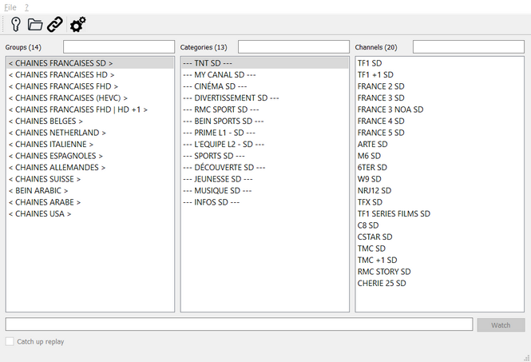

# iptv_playlist_browser
This tool allows to browse IPTV playlist in Windows.  
 
**This tool does not provide any stream**, you have to use your own.  
Please remember to use only legal streams. 

## Run 
```
python iptv_playlist_browser_gui.py
```
or try the [experimental binary](https://github.com/PhunkyBob/iptv_playlist_browser/releases/latest). 

In your first run, go to `Preferences...` menu and set a path for your desired video player. 


## Usage
### Main window

#### 1. Menu bar
Get quick access to the main features of the application (open Xtream Code, open playlist, preferences, ...). 

#### 2. Filter
When you have a lot of groups / categories / channels, you can filter them using this text areas.  

#### 3. Groups
List of groups. 
Groups come from the values in Xtream API (if available), from the playlist (if available).  
If the groups do not exist, the application will create them artificially according to the parameters.  
 
Select a group to view it's categories. 

#### 4. Categories
List of categories. 
The application will create them artificially according to the parameters.  

Select a category to view it's channels.  

#### 5. Channels
List of channels.
Select a channel to view it's URL. 
Double-click on a channel to open it with your player.  

#### 6. Watch
You can see the URL of the selected channel. 
Click the `Watch` button to open it with your player. 

#### 7. Catch up
Some stream may have a catch up replay available. If so, check the `Catch up` chckbox, select a date, a time and duration and click the `Watch` button.  
You can find the current EPG in the combo box to easily choose your desired program.  


### Preferences

#### Video player
Give a path to your favorite video player executable.  
Eg. : `C:/Program Files (x86)/VideoLAN/VLC/vlc.exe`
#### Additional parameters
(optional) You can provide additional parameters to use with your player. 

Eg. : `--fullscreen` will launch VLC in fullscreen.  

#### Remember latest input
When checked, by default the program will remember your playlist local or remote path, and your Xtream code credentials.  


#### Always try to retreive Xtream Code
When checked, if you load a playlist the program will first give a try to the Xtream Code API.  
Xtream Code API allows to have better group naming and to play catch up streams. 

#### Group / category separator
Very often the channels in the playlist are separated by false channels to mark the boundary.  
Whith this parameter, you can specify what are the strings used as separator. 

Eg. : if your playlist is like 
```
#EXTM3U
#EXTINF:-1,< CHAINES FRANCAISES SD >
http://myserver.com:8000/login/password/1
#EXTINF:-1,--- TNT SD ---
http://myserver.com:8000/login/password/2
#EXTINF:-1,TF1 SD
http://myserver.com:8000/login/password/3
#EXTINF:-1,TF1 +1 SD
http://myserver.com:8000/login/password/4
#EXTINF:-1,FRANCE 2 SD
http://myserver.com:8000/login/password/5
#EXTINF:-1,FRANCE 3 SD
http://myserver.com:8000/login/password/6
```
and you set 
```
<
```
as group separator and 
```
--
``` 
as category separator, all lines containing `<` will be considered as "group" and all lines containing `--` will be considered as "category".  
You'll obtain: 



#### Load playlist from Xtream Code
Give your Xtream Code credentials. 

#### Load playlist from local file
Open a local playlist file (m3u).  
A preview of the names inside the file allows you to guess what separators should be used. 

#### Load playlist from remote file
Open a remote playlist file (m3u).  

Eg.: `http://myserver.com:8000/get.php?username=login&password=password&type=m3u&output=mpegts`

#### Filtrer lists
Type part of desired group, category or channel you want to filter. 

#### Watch a stream
Double-click on an entry in the channel list, or select it then click on the `Watch` button. 

#### Replay a past stream
If you opened your playlist with Xtream Code **and** your provider gives this functionality, you can select a time and date for a specific channel. 
A list gives you the latest EPG availble to help you. 

Note that not all providers gives this functionality. 


## How to install
### Prerequisite
- [Python 3.9+](https://www.python.org/downloads/)

### Install
In a command line editor: 
```
git clone https://github.com/PhunkyBob/iptv_playlist_browser.git
cd iptv_playlist_browser
python -m venv env
env\Scripts\activate.bat
pip install -U pip
pip install -r requirements.txt
```
